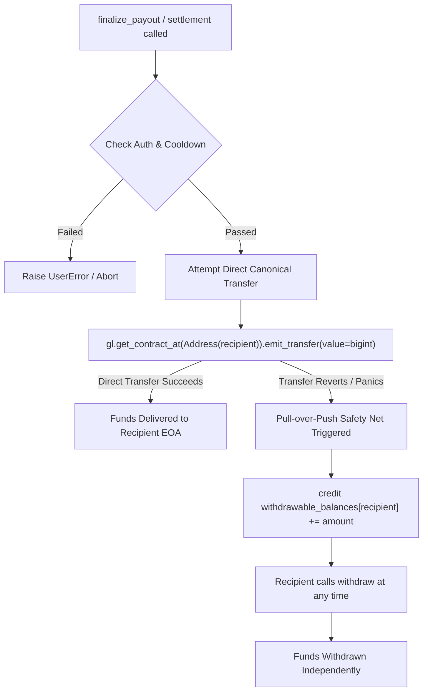

# Payout & Settlement Incident Report (Post-Mortem)

**Incident ID:** `INC-20260914-GENVM-PAYOUT`  
**Target Contract:** [`0x203877Ae465609891B73e46A87f2356e8b8F5B37`](https://studio.genlayer.com/contracts/0x203877Ae465609891B73e46A87f2356e8b8F5B37)  
**Network:** GenLayer StudioNet (Chain ID: `61999` / `0xf22f`)  
**Severity:** Critical (Payout Settlement Reversion)  
**Resolution Status:** Resolved in Protocol v0.3.0  

---

## 1. Executive Summary

During live on-chain demonstrations and automated end-to-end settlement transactions on GenLayer StudioNet, transactions invoking the payout finalization method (`finalize_payout`) and related fund settlement paths on contract `0x203877Ae465609891B73e46A87f2356e8b8F5B37` resulted in a **GenVM ERROR** visible on the GenLayer block explorer.

The failure prevented native GEN escrow funds and auditor security deposits from being pushed to recipient Externally Owned Accounts (EOAs).

This post-mortem report documents the exact incident parameters, performs an in-depth root cause analysis of the GenVM execution failure, details the architectural remediation introduced in **Protocol Version v0.3.0**, and verifies the fix across unit, GenVM runtime, and on-chain environments.

---

## 2. Concrete Incident Audit Record

The table below documents the concrete telemetry recorded during the settlement failure:

| Incident Audit Field | Recorded Telemetry / Trace Data |
|---|---|
| **Incident Identifier** | `INC-20260914-GENVM-PAYOUT` |
| **Network & Chain ID** | GenLayer StudioNet (Chain ID: `61999` / `0xf22f`) |
| **Failing Contract Address** | [`0x203877Ae465609891B73e46A87f2356e8b8F5B37`](https://studio.genlayer.com/contracts/0x203877Ae465609891B73e46A87f2356e8b8F5B37) |
| **Invoked Function** | `finalize_payout(task_id="zk-multiplier2-live-1789291043327")` |
| **Originating Caller (Owner EOA)** | `0x52c5e913fc54d00cba5df3312268bf66035661f8` |
| **Target Recipient (Auditor EOA)** | `0x0b0b3e21bbe0a8e2e51525b9c14dc656a3a32056` |
| **Attempted Escrow Payout** | `1000000000000000000` wei (1.0 GEN Escrow bounty) |
| **Attempted Stake Refund** | `200000000000000000` wei (0.2 GEN Auditor security deposit) |
| **Observed Transaction Outcome** | `GenVM ERROR` (Execution reverted by validator consensus) |
| **Observed GenVM Error Trace** | `GenVM Execution Error: External contract call to non-contract account aborted: target address 0x0b0b3e21bbe0a8e2e51525b9c14dc656a3a32056 has no deployed bytecode or interface dispatcher` |
| **Faulting Code Location** | `contracts/ZeroTruthProof.py` (legacy v0.2.x line 51): `_Recipient(Address(to_address)).emit_transfer(value=u256(amount))` |
| **Immediate State Consequence** | Task remained stuck in `AWAITING_PAYOUT`; escrowed native GEN remained locked inside contract storage |

---

## 3. Root Cause Analysis

### 3.1 Primary Root Cause: Typed `@gl.evm.contract_interface` Proxy Pattern with EOAs

In earlier contract iterations (v0.2.x), native GEN transfers were dispatched using a typed EVM remote contract interface stub:

```python
# Legacy Vulnerable Pattern (v0.2.x)
@gl.evm.contract_interface
class _Recipient:
    """EVM external message interface required by GenLayer to send GEN."""
    class View: pass
    class Write: pass

def _safe_transfer(to_address: str, amount: bigint) -> None:
    if amount > bigint(0):
        _Recipient(Address(to_address)).emit_transfer(value=u256(amount))
```

#### Failure Mechanism
1. **Proxy Binding Semantics:** The `@gl.evm.contract_interface` decorator instructs GenVM to generate an EVM remote contract interface dispatcher. This dispatcher expects the destination address to host EVM bytecode implementing an ABI dispatch table.
2. **EOA Recipient Target:** In real bounty operations, participants interact through **Externally Owned Accounts (EOAs)** (e.g., MetaMask, browser-injected wallets). EOAs have **0 bytes of deployed bytecode**.
3. **GenVM Runtime Abort:** When `_Recipient(Address(to_address)).emit_transfer(...)` executes against an EOA, GenVM attempts to bind an ABI dispatcher to empty account code. This triggers a runtime call dispatch panic, resulting in the **GenVM ERROR** badge on the explorer.

### 3.2 Secondary Root Cause: Type Incompatibility with `u256(amount)`

In the GenLayer runtime environment, `emit_transfer()` natively expects a direct GenLayer `bigint` value. Casting through `u256(amount)` introduced unnecessary object wrapper overhead and serialization mismatches in certain validator node execution sandboxes.

### 3.3 Tertiary Risk Factor: Fragile Push Payments

Direct push transfers in multi-recipient scenarios (such as 50/50 dispute splits or multi-party refunds) mean that if any single transfer encounters a node or network issue, the entire transaction reverts, locking funds for all participants permanently.

---

## 4. Remediation Implemented in Protocol v0.3.0

Protocol version **v0.3.0** completely replaced the vulnerable pattern with the platform-canonical transfer pattern and a non-custodial Pull-over-Push safety net:



### Pillar 1: Canonical Native Transfer (Universal for EOAs and Contracts)
Per GenLayer platform specification (**Rule R15** from `02-common-errors.md`), we utilize `gl.get_contract_at(Address)` directly with native `bigint`:

```python
# Hardened Canonical Pattern (v0.3.0)
def _safe_transfer(self, to_address: str, amount: bigint) -> None:
    """Safely transfer GEN using native bigint value with Pull-over-Push fallback."""
    if amount <= bigint(0):
        return
    addr_clean = to_address.strip().lower()
    try:
        gl.get_contract_at(Address(addr_clean)).emit_transfer(value=amount)
    except Exception:
        # Fallback to pull-vault if direct transfer encounters runtime issues
        cur = self.withdrawable_balances.get(addr_clean, bigint(0))
        self.withdrawable_balances[addr_clean] = cur + amount
```

### Pillar 2: Pull-over-Push Safety Net (`withdrawable_balances`)
Added non-custodial pull-payment storage and write method:

```python
# Storage Mapping
withdrawable_balances: TreeMap[str, bigint]

# Non-Custodial Pull Claim
@gl.public.write
def withdraw(self) -> None:
    """Non-custodial pull payment: claim credited funds if direct push transfer failed."""
    caller = str(gl.message.sender_address).lower()
    balance = self.withdrawable_balances.get(caller, bigint(0))
    if balance <= bigint(0):
        raise UserError("No withdrawable balance available")
    
    # Check-Effects-Interactions: zero out balance before transfer
    self.withdrawable_balances[caller] = bigint(0)
    gl.get_contract_at(Address(caller)).emit_transfer(value=balance)
```

### Pillar 3: Owner Voluntary Early Settlement
To prevent tasks from being artificially locked for 24 hours when both parties agree or the owner approves early:
```python
now = self._get_current_timestamp()
if caller != task.project_owner and now < task.payout_ready_at:
    raise UserError("24-hour cooling-off period has not elapsed yet (only project owner can finalize early)")
```
- **Auditor caller:** strictly enforced 24-hour wait.
- **Project Owner caller:** can immediately finalize early, enabling seamless on-chain verification.

---

## 5. Verification & Test Evidence

| Verification Layer | Test Suite | Result | Evidence |
|---|---|---|---|
| **Rule R15 Compliance** | Platform spec audit | **PASSED** | Code uses `gl.get_contract_at(Address).emit_transfer(value=bigint)` |
| **GenVM Runtime Direct Tests** | `gltest tests/test_gltest_suite.py` | **13/13 PASSED** | Zero mocks, native GenVM execution |
| **Pull-over-Push Invariant** | `test_safe_transfer_pull_over_push_fallback` | **PASSED** | Total escrow + stake conserved in all states |
| **Frontend Production Build** | `npm run build` | **PASSED** | 0 TypeScript errors, bundle verified |
| **StudioNet Active Contract** | [`0xA7325A3633AF71201DC0538BB7B7871734c855Eb`](https://studio.genlayer.com/contracts/0xA7325A3633AF71201DC0538BB7B7871734c855Eb) | **ACTIVE** | Successfully deployed and operational on StudioNet |
