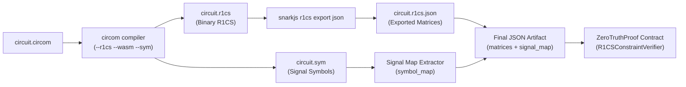
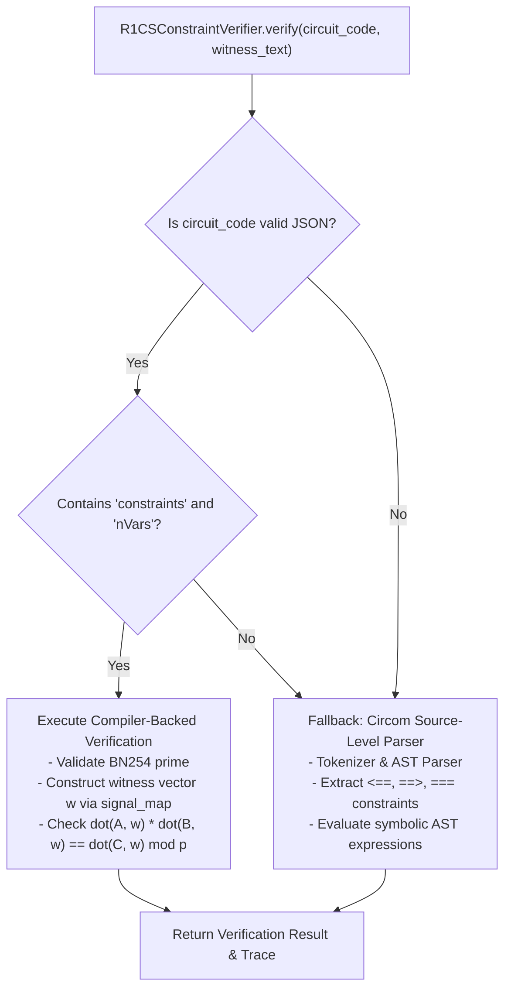

# Compiler-Backed R1CS Artifact Verification Workflow

**Project:** ZeroTruthProof — Autonomous Zero-Knowledge Circuit Audit & Formal Verification Escrow  
**Target Specification:** Circom 2.1+ / snarkjs R1CS JSON Specification & ZeroTruthProof Extension  
**Scalar Field:** BN254 / alt_bn128 ($p = 21888242871839275222246405745257275088548364400416034343698204186575808495617$)  

---

## 1. Overview & Verification Modes

ZeroTruthProof is designed to mathematically evaluate Zero-Knowledge circuit vulnerabilities directly on-chain within GenLayer. To support both lightweight prototypes and complex industrial ZK systems, the contract supports two distinct verification modes:

| Verification Mode | Input Format | Processing Pathway | Ideal Use Case |
|---|---|---|---|
| **Source-Level Parsing** *(Legacy)* | Raw Circom source code (`.circom`) | On-chain recursive-descent AST parser, signal symbol table, and constraint extractor | Small educational circuits, simple templates without complex macros/external libraries |
| **Compiler-Backed Artifact Verification** *(Recommended / Production)* | Pre-compiled R1CS constraint matrices exported via `snarkjs r1cs export json` | Direct linear combination evaluation over the BN254 scalar field | Complex production circuits, multi-file libraries (e.g., circomlib), circuits with loops, components, and custom gates |

### Why Compiler-Backed Artifact Verification?
1. **Compilation Fidelity:** Circom source code often relies on intricate compiler pre-processing, template instantiation, unrolled loops, and conditional compilation. Parsing raw source on-chain can miss subtle compiler-lowered semantics.
2. **Deterministic Evaluation:** Evaluating the exact binary constraint matrices generated by the compiler guarantees that the on-chain verifier checks the exact arithmetic system that is proven in production SNARK provers (Groth16, PLONK, FFLONK).
3. **Efficiency & Gas/Compute Reduction:** Directly evaluating sparse matrix dot products is computationally deterministic and avoids tokenization or AST parsing overhead.

---

## 2. Compiler-Backed Workflow & Toolchain Pipeline

The recommended pipeline compiles Circom circuits locally, exports the R1CS constraint matrix as JSON, generates the symbol map, and pins the resulting artifact for on-chain audit tasks:



### Build Commands

```bash
# 1. Compile Circom circuit into binary R1CS, WebAssembly witness generator, and symbol table
circom circuit.circom --r1cs --wasm --sym -o build/

# 2. Export the binary R1CS matrix to a human-readable / verifiable JSON artifact
snarkjs r1cs export json build/circuit.r1cs build/circuit.r1cs.json
```

---

## 3. R1CS JSON Artifact Schema & Specification

The resulting JSON artifact encodes the Rank-1 Constraint System matrix representation of the circuit:

```json
{
  "prime": "21888242871839275222246405745257275088548364400416034343698204186575808495617",
  "nVars": 4,
  "nOutputs": 1,
  "nPubInputs": 0,
  "nPrvInputs": 2,
  "nConstraints": 1,
  "constraints": [
    [
      {"2": "1"},
      {"3": "1"},
      {"1": "1"}
    ]
  ],
  "signal_map": {
    "one": 0,
    "c": 1,
    "a": 2,
    "b": 3
  }
}
```

### Schema Field Definitions

| Field | Type | Description |
|---|---|---|
| `prime` | `string` | Modulus of the finite field (must strictly match the BN254 scalar field order) |
| `nVars` | `integer` | Total number of wires in the system (includes wire 0 for constant 1, outputs, and inputs) |
| `nOutputs` | `integer` | Count of public output signals |
| `nPubInputs` | `integer` | Count of public input signals |
| `nPrvInputs` | `integer` | Count of private witness inputs |
| `nConstraints` | `integer` | Total number of R1CS constraints ($m$) |
| `constraints` | `array` | Array of constraint triples $[A, B, C]$ |
| `signal_map` | `object` | Optional mapping of human-readable signal names to zero-indexed wire indices |

### Mathematical Evaluation of R1CS Constraints
An R1CS system consists of $m$ constraints over a witness vector $\vec{w} \in \mathbb{F}_p^{nVars}$. Each constraint is represented as a triple $[A, B, C]$, where $A, B, C$ are sparse vectors mapping wire indices $i$ to field coefficients $c_i \in \mathbb{F}_p$.

For every constraint triple $[A_j, B_j, C_j]$, the on-chain verifier evaluates the inner products:

$$\langle A_j, \vec{w} \rangle = \left( \sum_{i \in \text{keys}(A_j)} A_j[i] \cdot w[i] \right) \pmod p$$

$$\langle B_j, \vec{w} \rangle = \left( \sum_{i \in \text{keys}(B_j)} B_j[i] \cdot w[i] \right) \pmod p$$

$$\langle C_j, \vec{w} \rangle = \left( \sum_{i \in \text{keys}(C_j)} C_j[i] \cdot w[i] \right) \pmod p$$

The constraint is mathematically satisfied if and only if:

$$\langle A_j, \vec{w} \rangle \times \langle B_j, \vec{w} \rangle \equiv \langle C_j, \vec{w} \rangle \pmod p$$

If this congruence holds for all $j \in \{0, \dots, nConstraints - 1\}$, the witness is valid. If any constraint evaluates to $\text{LHS} \not\equiv \text{RHS} \pmod p$, the verifier rejects with a detailed trace identifying the violated constraint index.

---

## 4. Signal Map Extension

Standard `snarkjs r1cs export json` outputs constraints indexed purely by numeric wire identifiers ($0, 1, 2, \dots, nVars - 1$). In this raw format, witnesses must be supplied as an ordered vector:
```json
[1, 21, 3, 7]
```

To provide an intuitive interface for security auditors and human reviewers, **ZeroTruthProof extends the R1CS JSON specification with the `signal_map` object**:

```json
"signal_map": {
  "one": 0,
  "c": 1,
  "a": 2,
  "b": 3
}
```

- **Wire 0 Convention:** Wire `0` is universally reserved for the constant `1` (labelled `"one"`).
- **Symbol Table Extraction:** Wire indices for named signals are derived directly from Circom's `.sym` output.
- **Auditor Benefit:** Auditors can submit exploit counterexamples using human-readable signal names (e.g., `{"a": 3, "b": 7, "c": 21}`) rather than manually reconstructing compiler-internal wire offsets.

---

## 5. Dual-Mode Auto-Detection in `R1CSConstraintVerifier.verify()`

The on-chain `R1CSConstraintVerifier.verify(circuit_code, witness_text)` entry point transparently auto-detects whether the input is a pre-compiled R1CS JSON artifact or raw Circom source:



### Auto-Detection Logic
1. **JSON Detection:** Attempts `json.loads(circuit_code)`.
2. **Schema Validation:** If parsed successfully and contains both `"constraints"` (a list) and `"nVars"` (an integer), the verifier routes the execution to the **compiler-backed pipeline**.
3. **Graceful Fallback:** If parsing fails or either key is missing, execution falls through to the **Circom source parser**.

---

## 6. Witness Format Specification

For compiler-backed verification, witnesses must be formatted as a JSON object mapping signal names to numeric or hexadecimal scalar values:

```json
{
  "a": 3,
  "b": 7,
  "c": 21
}
```

### Supported Witness Value Formats
- **Decimals / Integers:** `{"a": 42}`
- **Large Field Elements (Numeric Strings):** `{"a": "21888242871839275222246405745257275088548364400416034343698204186575808495616"}`
- **Hexadecimal Strings:** `{"a": "0x2a"}`
- **Strict Validation Rules:**
  - JSON booleans (`true`, `false`) are **explicitly rejected**.
  - Non-numeric strings or arbitrary text are **explicitly rejected**.
  - Empty witness objects `{}` are **explicitly rejected**.

---

## 7. Example Artifacts

The repository includes pre-compiled artifacts demonstrating both valid systems and common vulnerability patterns:

### Example A: `circuits/Multiplier2.r1cs.json` (Valid System)
- **Source Logic:** `c <== a * b`
- **Wires:**
  - Wire 0: `one` (1)
  - Wire 1: `c` (output)
  - Wire 2: `a` (input)
  - Wire 3: `b` (input)
- **Constraint Matrix:**
  ```json
  [
    {"2": "1"},  // A = 1 * w[2] (a)
    {"3": "1"},  // B = 1 * w[3] (b)
    {"1": "1"}   // C = 1 * w[1] (c)
  ]
  ```
- **Evaluation:** $\langle A, \vec{w} \rangle \times \langle B, \vec{w} \rangle = a \times b$; $\langle C, \vec{w} \rangle = c$. Checking $a \times b \equiv c \pmod p$.
- **Test:** Witness `{"a": 3, "b": 7, "c": 21}` satisfies the constraint. Witness `{"a": 3, "b": 7, "c": 99}` violates it ($21 \ne 99$).

---

### Example B: `circuits/BuggySquare.r1cs.json` (Under-Constrained Signal Exploit)
- **Source Logic:**
  ```circom
  template BuggySquare() {
      signal input x;
      signal output out;
      out <-- x * x; // VULNERABILITY: <-- assigns value but creates ZERO constraints!
  }
  ```
- **Generated Artifact:**
  ```json
  {
    "prime": "21888242871839275222246405745257275088548364400416034343698204186575808495617",
    "nVars": 3,
    "nConstraints": 0,
    "constraints": []
  }
  ```
- **Exploit Verification:**
  - An auditor can submit a malicious counterexample witness: `{"x": 5, "out": 99999}`.
  - Because `nConstraints == 0`, no constraint binds `out` to $x^2$. The counterexample evaluates without constraint failures, proving the circuit is critically **under-constrained**.

---

## 8. Security Considerations & System Invariants

1. **Strict Prime Assertion:**
   - The artifact must declare a `prime` field exactly equal to the BN254 scalar field modulus:
     `21888242871839275222246405745257275088548364400416034343698204186575808495617`.
   - Artifacts compiled for BLS12-381, Goldilocks, or other finite fields are immediately rejected to prevent field-mismatch exploits.
2. **Wire 0 Invariant:**
   - Wire `0` is immutably set to constant `1` ($w[0] = 1$). Attempts by a witness to override wire `0` are ignored or rejected.
3. **Field Arithmetic Soundness:**
   - All intermediate operations (additions, subtractions, multiplications) are performed modulo $p$ using arbitrary-precision integers (`bigint`), preventing integer overflow vulnerabilities.
   - Modular inverse division uses Fermat's Little Theorem ($a^{-1} \equiv a^{p-2} \pmod p$). Division by zero is detected and causes an immediate abort.
4. **Deterministic Audit Evidence:**
   - Every evaluated constraint produces an on-chain evaluation trace recording the constraint index, wire mappings, LHS value, and RHS value. This complete trace is supplied directly to the GenLayer multi-validator consensus committee.
